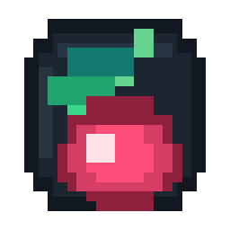

# CherryPilot

[English](README.md) | [简体中文](README.zh-CN.md)

> A floating desktop AI pilot for screenshots, files, voice input, local/cloud models, and guarded workspace automation.

CherryPilot is an Electron desktop companion that stays above your workspace as a compact floating icon. It can answer from selected screen regions, active-window context, dropped files, voice commands, and configured OpenAI-compatible providers. When explicitly authorized, it can also read/write inside a chosen workspace and run a narrow set of developer commands.




## Features

- Floating compact assistant with pinning, drag, edge docking, and expanded settings panel.
- Region screenshots with preview/delete before the image is sent as context.
- File context ingestion for PDF, DOCX, Markdown, logs, JSON, HTML/CSS/JS/TS, Python, Java, C/C++ and plain text.
- Voice wake phrase flow, transcription, question answering, and image generation commands.
- Multiple OpenAI-compatible provider slots plus local Ollama / LM Studio style endpoints.
- Model list refresh and quick model switching from the compact panel.
- History panel with short question titles and full-answer detail view.
- Optional workspace authorization for AI file read/write and project creation.
- Separate command permission for guarded build/debug/test/publish commands.
- LAN sharing server for trusted local-network devices.
- Low CPU mode and startup launch settings.
- Desktop auto-update support through `electron-updater`.

## Requirements

- Node.js 20 or newer.
- Windows for the default NSIS installer target.
- macOS only when building the macOS DMG target.

## Quick Install

```powershell
npm install
npm start
```

`npm start` builds the Vite renderer and Electron main process, then launches the desktop app.

## Troubleshooting

### API key or model errors

Open the main panel, fill in the provider API key, base URL, and model, then save settings. Local endpoints such as Ollama and LM Studio usually use:

```text
http://127.0.0.1:11434/v1
```

### Screenshot does not start

Make sure no capture window is already open, then retry the screenshot button or global shortcut. On Windows, packaged builds may need screen-capture permission from security software.

### Workspace tools are unavailable

Choose a workspace folder first. Command execution also requires the separate command-access toggle.

### Build artifacts look stale

```powershell
npm run clean:dist
npm run build
```

## Build From Source

Type-check, lint, and build:

```powershell
npm run lint
npm run typecheck
npm run build
```

Windows unpacked app:

```powershell
npm run pack
```

Windows installer:

```powershell
npm run dist
```

Expected installer output:

```text
dist/CherryPilot-Setup-0.1.0.exe
dist/CherryPilot-Setup-0.1.0.exe.blockmap
dist/latest.yml
```

macOS DMG:

```powershell
npm run dist:mac
```

Run the macOS target on macOS or a macOS CI runner.

## Desktop Auto Update

CherryPilot checks for updates in packaged desktop builds. Configure the update feed in `src/update-config.json`, or override it with `CHERRYPILOT_UPDATE_URL`.

For the generic updater, upload these files to the same update directory:

```text
latest.yml
CherryPilot-Setup-<version>.exe
CherryPilot-Setup-<version>.exe.blockmap
```

Bump `package.json` `version` before every release.

## Workspace Safety

Use a dedicated workspace folder. Avoid authorizing Desktop, Downloads, your home directory, or repositories containing secrets.

The app blocks direct opening of executable/script file types such as `.exe`, `.bat`, `.cmd`, `.ps1`, and `.reg`. Command tools are off by default and only allow whitelisted developer commands.

## Project Structure

```text
src/main/main.ts              Electron main process, windows, IPC, AI requests, tools, LAN sharing
src/main/preload.ts           Main-window bridge API
src/main/capture-preload.ts   Capture-window bridge API
src/renderer/App.vue          Vue 3 renderer lifecycle shell
src/renderer/main.ts          Vue/Vite renderer entry
src/renderer/controller.ts    UI controller, compact prompt, localization, settings, history
src/capture/main.ts           Capture interaction
src/index.html                Main window HTML shell
src/capture.html              Capture window HTML shell
src/styles.css                Main UI styles
src/capture.css               Capture styles
src/assets/                   App icons
vite.renderer.config.ts       Vite renderer build config
vite.main.config.ts           Vite Electron main/preload build config
scripts/                      Utility scripts
```

## Status

CherryPilot is an early desktop app. The current priority is keeping the desktop Electron experience stable while gradually splitting the migrated renderer controller into smaller Vue/TypeScript modules.

## License

MIT
